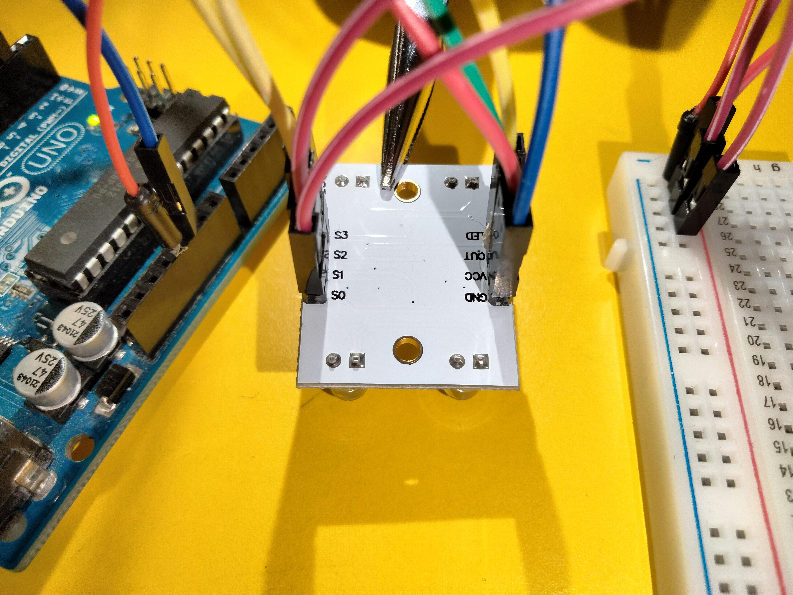
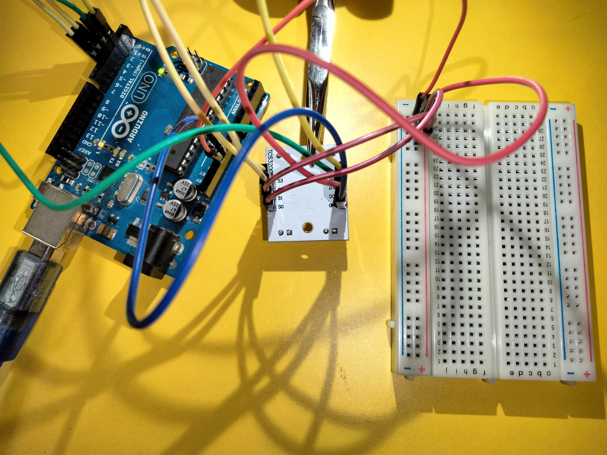

# Using a TCS3200 Colour Sensor with an Arduino

The TCS3200 is a simple colour sensor which is able to read red, green and blue
light levels and has toggleable LEDs. We will interface with it using an 
Arduino. For this you will need

* An Arduino.
* A TCS3200 colour sensor.
* A breadboard and jumper wires for wiring.

Use the breadboard for power delivery, connecting the `5V` output port on the
Arduino to the positive power line on the breadboard. We will wire three pins
on the colour sensor to this line.

* `VCC` for power delivery to the sensor.
* `S0` because we want to set this pin to `HIGH`, which is equivalent to
    connecting it to `5V`, but a little simpler.
* `S1` for the same reason as `S0`.

We connect `S0` and `S1` to power because this sets the output frequency 
scaling to 100%. Once you've connected these pins to power, connect the 
following pins

* `GND` to any `GND` pin on the Arduino.
* `OUT` to any digital pin on the Arduino (the example code uses `3`).
* `LED` to a digital pin (example uses `2`).
* `S2` to a digital pin (example uses `5`).
* `S3` to a digital pin (example uses `4`).

Having connected these pins, you should be able to upload the example code to
the Arduino, open the serial monitor and read the output of the colour sensor.
Your setup should look something like the below

