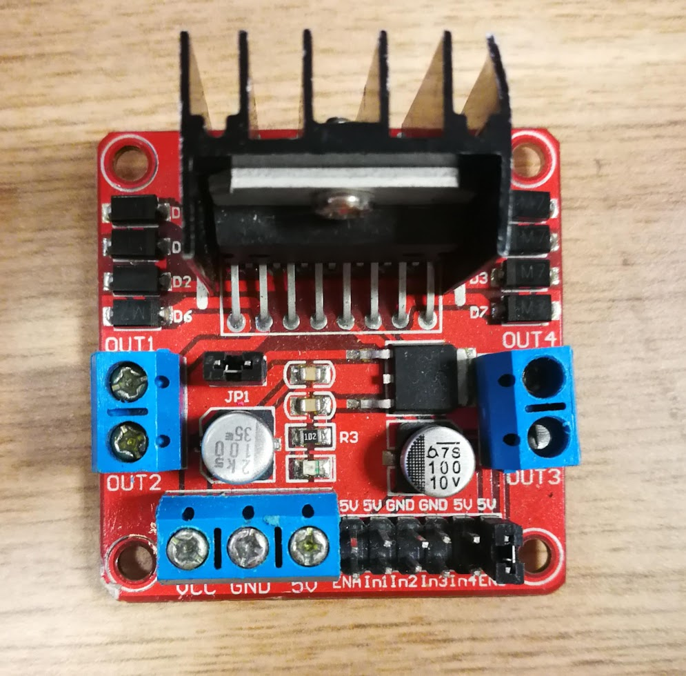

# Driving DC Motors with an Arduino and L298N

To turn a motor, we need to apply a voltage from a battery across the terminals
of the motor. If we want to be able to control how fast the motor turns, we
need to be able to use a program to adjust this voltage. We can do this using
an Arduino board an motor driver. The Arduino will send signals to the motor
driver, which will adjust the voltage across the motor terminals. First, we
need to wire up our components.

## Wiring

We need to wire the battery to the motor driver, to provide power, the motor 
driver to the battery, to drive the motor, and the Arduino to the motor driver
to control the motor. The motor driver looks like this

Each motor has two wires, and these need to be connected to the output ports of
the motor driver, arranged in pairs on the left and right in the image above,
labelled `OUT1`, `OUT2`, `OUT3` and `OUT4`. To connect a motor to the motor 
driver

* Choose one of these pairs (e.g. `OUT1` and `OUT2`).
* Use a small screwdriver to open the ports by loosening the screws.
* Push the terminals of the motor into these ports. It doesn't matter which way
    around they are, switching them will just reverse the direction.
* Tighten the screws to hold the wires in place.

Now, connect the battery to the motor driver, using a screwdriver as you did
for to motor wires. Make sure you use thick wires for this (not jumper wires),
as the motors can draw a high enough current to melt jumper wires. The live wire
of the battery (red) needs to be screwed into `VCC` (bottom left port in the 
image above) and the ground (black) needs to be screwed into `GND` (to the right
of `VCC`). Once you've connected these correctly, the LED on the motor driver
should come on.

Finally, the Arduino needs to be connected. This will require three wires from
the Arduino to the motor driver, two for logical control over the motor and one
for a common ground between the components. You can use jumper wires for this,
and should as they will fit nicely into the Arduino ports.

* Connect a wire from a `GND` port on the Arduino to the `GND` port on the
    motor driver. You can just screw it into the same port as the battery
    ground.
* Connect the input ports which match the output ports you chose for the motor
    to PWM ports on the Arduino.
    * The input ports for the motor driver are the pins located in the bottom
        right of the image above. `In1` and `In2` control `OUT1` and `OUT2`,
        and likewise for `In3` and `In4` for `OUT3` and `OUT4`.
    * PWM ports on the Arduino are those labelled with a `~`, for example ports
        `~5` and `~6` on an Arduino Uno.

You should now be able to program the Arduino to control the motors. Maybe try
the `motor_simple` example from this directory.
